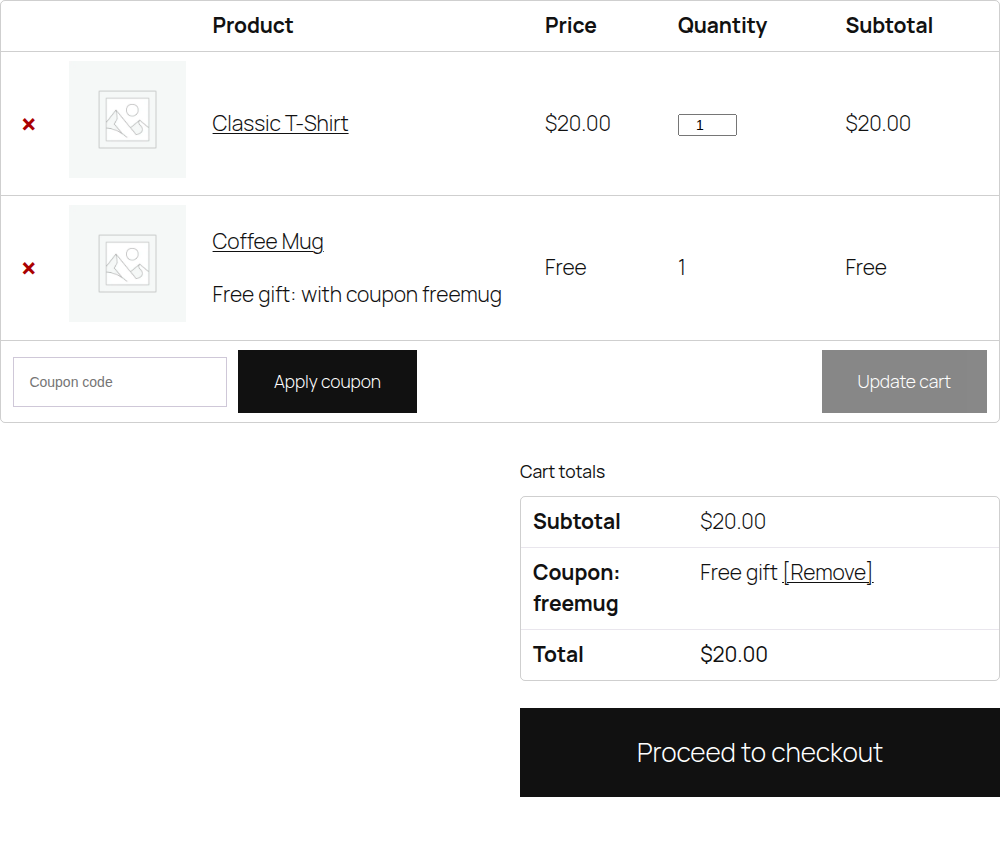
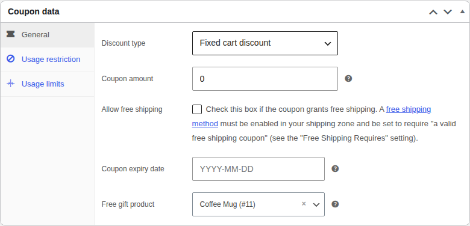
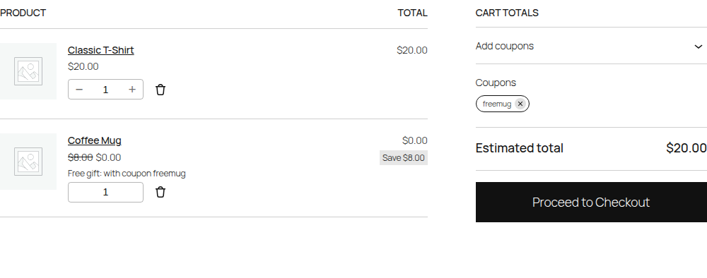
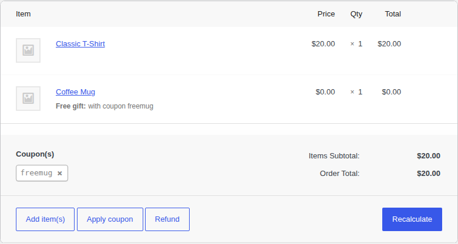

# Tagalong Gifts for WooCommerce

**Give customers a free product when they use a coupon, for example "Use code FREEMUG and get a mug free".**

Free · Open source · Works with the block cart and the classic cart · No settings page to learn

You choose the gift on the coupon's own edit screen. When a customer applies that coupon, the gift is added to their cart at no cost. The gift tags along with the coupon: if either is removed, the other goes too. The gift shows up clearly on the order, so whoever packs it knows why it's there.



## What it does

- **Adds the gift automatically.** Apply the coupon and one of the gift product goes into the cart.
- **Makes it actually free.** The gift is priced at 0 in the cart total, not just labelled "Free".
- **Keeps one gift per coupon.** The customer can't raise the gift's quantity. If they also buy the same product, those units stay paid and appear as a separate line.
- **Keeps coupon and gift together.** Remove the gift and the coupon is removed. Remove the coupon, or let WooCommerce drop it (for example, the cart falls below the coupon's minimum spend), and the gift is removed.
- **Refuses a coupon whose gift isn't available** (out of stock, deleted or not for sale), with a clear message instead of a coupon that does nothing.
- **Labels the gift everywhere:** "Free gift: with coupon freemug" in the cart, checkout, order emails, My Account and the order screen, plus a private order note.
- **Works with WooCommerce's current and classic setups:** Cart and Checkout blocks, the classic shortcode pages, and both order storage types (HPOS and the older posts storage).

## Install

1. Click the green **Code** button at the top of this page → **Download ZIP**.
2. In WordPress, go to **Plugins → Add New Plugin → Upload Plugin**, choose the ZIP and click **Install Now**, then **Activate**.

WooCommerce must be installed and active.

> **Used the old snippet (version 1)?** Remove the old code from your theme's `functions.php` (or wherever you pasted it) before activating, then set up your gift coupons as below. See [Upgrading from version 1](#upgrading-from-version-1).

## Set up a gift coupon

| Step | What you do |
|---|---|
| **1. Get the gift product ready** | Any normal product works. It needs a price and must be in stock. The customer never pays that price. To stop people buying it on its own, set **Catalog visibility: Hidden**. |
| **2. Create the coupon** | **Marketing → Coupons → Add coupon**. Enter a code, for example `FREEMUG`. For a gift-only coupon, use **Fixed cart discount** with **Coupon amount 0**. The coupon can also give a normal discount as well as the gift. |
| **3. Choose the gift** | Still on the **General** tab, search for the product under **Free gift product**. Choose a simple product or one exact variation, like *Hoodie – Medium*. |
| **4. Add any rules** | Use WooCommerce's normal **Usage restriction** and **Usage limits** tabs: minimum spend, expiry date, one use per customer, and so on. They all still apply. |
| **5. Publish** | Customers can now use the code in the cart or at checkout. |



### What the customer sees

| The customer… | What happens |
|---|---|
| applies the coupon | The gift is added. The classic cart shows **Free** and a success message. The block cart shows the original price crossed out and **$0.00**. |
| tries to change the gift's quantity | They can't. It stays at 1. |
| removes the gift | The coupon is removed too, with a message. On the classic cart, **Undo** puts both back. |
| removes the coupon | The gift is removed. |
| no longer meets the coupon's rules | WooCommerce removes the coupon, and the gift goes with it. |
| applies the coupon when the gift is out of stock | The coupon is refused: *"Sorry, the free gift for this coupon is out of stock right now."* |



### On the order

The gift is a normal order line at $0.00 with **Free gift: with coupon …** under it. It reduces stock like any other product. A private note is also added, for example *Free gift "Coffee Mug" (#11) added with coupon "freemug".*



## Upgrading from version 1

Version 1 was a code snippet with a `$gift_coupon_map` array. Several of its problems meant it didn't work as described:

- **The coupon never matched.** WooCommerce saves coupon codes in lowercase, so a key like `'FREESHIRT'` never equalled the applied code and no gift was added.
- **The gift was still charged.** The snippet only changed the price *label* to FREE. The cart total still included the full price.
- **The order note was lost.** It was added before the order was saved, when the order had no ID, and the block checkout never ran that code at all.
- **The FREE label spread to paid units.** The gift could have its quantity raised, and every unit of that product was shown as FREE while still being charged.
- **Nothing happened in the block cart,** which is WooCommerce's default now.

To upgrade:

1. Delete the old snippet.
2. Install this plugin.
3. Open each gift coupon and choose its **Free gift product**.

If you'd rather keep the mapping in code, use the `tagalong_gift_coupon_map` filter. Codes are matched in any letter case:

```php
add_filter( 'tagalong_gift_coupon_map', function ( $map ) {
	$map['FREESHIRT'] = 123; // Coupon code => product or variation ID.
	return $map;
} );
```

---

## How it's built

A single-file WordPress plugin ([`tagalong-gifts-for-woocommerce.php`](tagalong-gifts-for-woocommerce.php), about 700 lines with comments) that uses only WooCommerce's own hooks. It has no settings page, no database tables, no JavaScript and no CSS.

### Highlights

- **The gift is a real cart line with a marker.** It's added with extra cart data (`tagalong_gift_for => coupon code`). That keeps it apart from paid units of the same product, and it survives page loads with the cart session.
- **The price is set, not just displayed.** `woocommerce_before_calculate_totals` sets the gift's price to 0 and its quantity to 1 before every total calculation, so every total, tax line and payment gateway sees the right amount.
- **Sync in both directions, with a safety net.** Separate hooks handle a coupon being applied or removed and a gift being removed or restored. One sync pass before each total calculation also fixes any mismatch that slipped past them, for example when all coupons are cleared at once.
- **Validation where WooCommerce expects it.** An unavailable gift makes the coupon invalid through `woocommerce_coupon_is_valid`. WooCommerce then shows the message everywhere, including the block cart.
- **One code path for block and classic checkout.** The gift marker is copied to the order line in `woocommerce_checkout_create_order_line_item`, which both checkouts call. The note is written after the order is saved, from `woocommerce_checkout_order_created` (classic) and `woocommerce_store_api_checkout_order_processed` (blocks), and only once.
- **Declared compatible** with High-Performance Order Storage and the Cart and Checkout blocks, and uses only WooCommerce's object API for orders.
- **End-to-end tests** on a real WordPress and WooCommerce site, covering the Store API, the classic cart in a browser, the admin, and the PHP error log.

### How it works

```text
 Customer applies coupon
          │
          ▼
 woocommerce_coupon_is_valid ── gift unavailable? ──► coupon refused, with a message
          │ valid
          ▼
 woocommerce_applied_coupon ──► add gift line { tagalong_gift_for: "freemug" }
          │
          ▼
 before every total calculation (sync_cart)
   • gift price = 0, quantity = 1
   • gift whose coupon is gone ──► remove gift
   • gift coupon whose gift is gone ──► remove coupon
          │
          ▼
 Checkout (classic or blocks)
   • order line gets hidden meta _tagalong_gift_coupon
   • shown as "Free gift: with coupon freemug"
   • private order note, written once
```

### Key design decisions

**Settings on the coupon, not in code.** A shop manager who creates a coupon can choose the gift in the same place, and the plugin needs no settings page. The code-based map is still there as a filter for developers and for upgrading from version 1.

**Match coupon codes the way WooCommerce does.** Every code goes through `wc_format_coupon_code()` before comparison. That's what version 1 missed.

**Change the price, not just the label.** Changing only the displayed price leaves totals, taxes and payment amounts wrong. Setting the product price in the cart fixes all of them at once. The "Free" label on the classic cart is only cosmetic on top of that.

**Keep the gift on its own line.** Without a marker, a gift and a paid unit of the same product would merge into one line, and there would be no reliable way to say which unit is free.

**Refuse the coupon instead of silently skipping the gift.** If the gift can't be added, a coupon that applies but gives nothing looks like a bug to the customer. Refusing it with a clear reason is honest, and it uses WooCommerce's own error display.

**Don't leave stray notices.** Messages are shown on classic pages only. In the block cart there's nowhere to show them, and a message saved in the session would appear later on an unrelated page.

### Hooks for developers

| Filter | Arguments | Use it to |
|---|---|---|
| `tagalong_gift_coupon_map` | `array $map` | Map coupon codes to product or variation IDs in code. It takes priority over the coupon setting. |
| `tagalong_gift_product_id` | `int $product_id, string $code` | Decide the gift for a coupon at runtime. Return 0 for no gift. |
| `tagalong_remove_coupon_with_gift` | `bool $remove, string $code` | Return `false` to keep the coupon when the customer removes the gift. |
| `tagalong_free_price_html` | `string $html, array $cart_item` | Change the "Free" label in the classic cart. |

Data it stores: coupon meta `_tagalong_gift_product_id`, order line meta `_tagalong_gift_coupon`, and order meta `_tagalong_gift_note_added`. Deleting the plugin removes the coupon setting. Past orders keep their gift details.

### Tests

The tests start a throwaway WordPress site with [WordPress Playground](https://wordpress.org/playground/), which runs PHP inside Node.js. You don't need a local server, a database or Docker. The site installs the latest WordPress and WooCommerce, mounts this plugin, and creates demo products and coupons.

- **Block cart (Store API):** gift added in any letter case, price 0, quantity locked, removal both ways, paid and gift units kept apart, an out-of-stock gift, a variation as the gift, the code-based map, minimum spend, use alongside a discount coupon, no stray notices, and a full block checkout with the order line and note checked.
- **Classic cart and checkout** in Chromium: the "Free" labels and fixed quantity, removing the gift with Undo, removing the coupon, and a full classic checkout.
- **Admin:** the coupon field shows and saves through the product search, a variable product is refused, and the order screen shows the readable gift line.
- **PHP log:** fails if the plugin causes any PHP error, warning, notice or deprecation.

Requires Node.js 20.18 or newer.

```bash
npm install
npx playwright install chromium
npm test                # HPOS order storage (default)
HPOS=0 npm test         # legacy order storage
PHP=7.4 npm test        # another PHP version
npm run screenshots     # also regenerates the images in screenshots/
```

On Windows PowerShell, set the variables first, for example `$env:HPOS=0; npm test`.

A full run takes several minutes, because PHP runs in WebAssembly and is slower than a normal server.

### Project structure

```text
Tagalong-Gifts-for-WooCommerce/
├── tagalong-gifts-for-woocommerce.php   the whole plugin
├── uninstall.php                     removes the coupon setting when the plugin is deleted
├── readme.txt                        the WordPress.org listing (description, FAQ, changelog)
├── .wordpress-org/                   WordPress.org icon, banner and screenshots
├── tests/
│   ├── e2e.test.mjs                  end-to-end tests (Node's test runner + Playwright)
│   ├── server.mjs                    starts the WordPress Playground test site
│   └── mu-plugins/                   test-site-only helpers: demo data and inspection routes
├── screenshots/                      images used in this README
├── package.json                      test setup only (the plugin itself has no dependencies)
└── LICENSE
```

`tests/`, `screenshots/`, `.wordpress-org/` and `package.json` are left out of **Download ZIP** (see `.gitattributes`), so the download is a clean plugin.

## Limitations

- One gift per coupon, always quantity 1. The customer can't choose between several gifts or pick a variation. You choose one exact variation.
- The gift is added in the storefront cart and checkout. Adding a gift coupon to an order by hand in the admin applies the coupon but doesn't add the gift.
- The gift product needs a price and must be purchasable. A product with an empty price can't be added to any cart, even for free.
- The block cart shows the gift as $0.00 with the original price crossed out. The word "Free" appears in the classic cart only.
- Tested with WordPress 7.1 and WooCommerce 11.1 on PHP 8.3 and 7.4, and with WordPress 6.5 and WooCommerce 8.5 on PHP 8.1.

## Changelog

**2.1.0**: Prepared for WordPress.org. Renamed to Tagalong Gifts for WooCommerce, with the code prefix changed from `gcl_` to `tagalong_` (if you installed 2.0.0, choose the gift on your coupons again). Added `readme.txt`. The coupon screen checks the security token and user permission itself before saving. Passes the official Plugin Check with no errors or warnings.

**2.0.0**: Rewritten as a WordPress plugin. Gift chosen on the coupon screen. Gift is now actually free, locked to quantity 1 and kept on its own line. Coupon codes match in any letter case. Supports the Cart and Checkout blocks and HPOS. Order note fixed. Out-of-stock gifts refuse the coupon with a message. End-to-end tests.

**1.0.0**: Original `functions.php` snippet.

## License

[MIT](LICENSE). Free to use, change and share.

*This is an independent project. It is not affiliated with, endorsed by or sponsored by WooCommerce or Automattic. "WooCommerce" is a trademark of Automattic Inc.*
